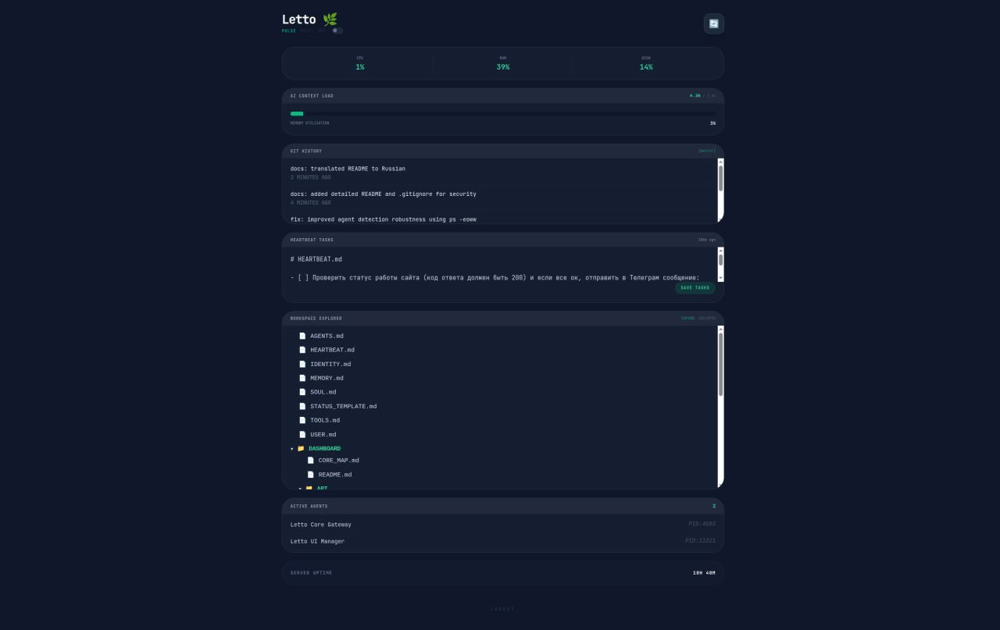
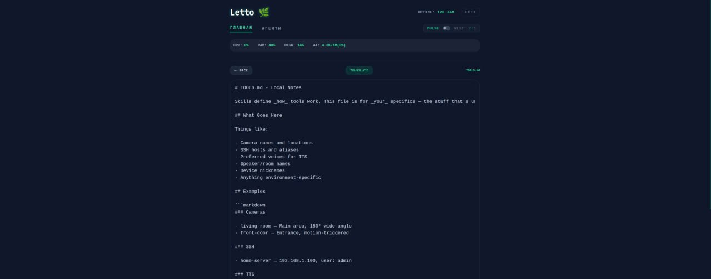

# Letto Dashboard 🌿

> **EXPERIMENTAL PROJECT:** Данный проект является экспериментом. Весь код, структура и документация полностью написаны ИИ в среде **OpenClaw**.

Модульная панель управления для экосистем OpenClaw. Оптимизирована для мобильных и десктопных экранов.


*Основной интерфейс мониторинга системы и управления*


*Встроенный просмотрщик файлов с поддержкой перевода*

## Особенности
- **Адаптивный дизайн:** Стиль "Dark Tech", шрифт JetBrains Mono.
- **Мониторинг системы:** CPU, RAM, Disk, Uptime.
- **AI Context Load:** Визуализация использования контекстного окна (токенов).
- **Интеграция с Git:** История последних коммитов и информация о текущей ветке в реальном времени.
- **Workspace Explorer:** Просмотр и чтение файлов рабочего пространства.
- **Менеджер Heartbeat:** Редактирование и синхронизация задач для фоновых проверок.
- **Магический вход:** Авторизация через GET-параметр `?key=` (удобно для закладок).
- **Трекинг агентов:** Список активных процессов OpenClaw.

## Доступные блоки и модули
- **System Stats:** Быстрый взгляд на ресурсы (CPU, RAM, DISK).
- **AI Context Load:** Контроль за наполнением контекстного окна.
- **Git History:** Лента последних изменений с указанием веток.
- **Heartbeat Tasks:** Редактор задач для фонового агента.
- **Workspace Explorer:** Файловый менеджер с предпросмотром кода.
- **Active Agents:** Список всех запущенных инстансов OpenClaw.
- **Cron Manager:** Управление запланированными задачами (погода, курсы и т.д.).

## Инструкция по установке

### 1. Требования
- Python 3.10+
- Библиотеки: `pip install fastapi uvicorn psutil pydantic`
- Работающий экземпляр [OpenClaw](https://github.com/openclaw/openclaw).

### 2. Быстрый старт (для человека и ИИ)
Если вы ИИ-ассистент или человек, настраивающий дашборд на новом сервере:

1. **Клонируйте репозиторий** в рабочую директорию OpenClaw:
   ```bash
   git clone https://github.com/DanielLetto2020/Letto-Dashboard.git dashboard
   ```
2. **Настройте переменные окружения:**
   Скопируйте шаблон и заполните его (файл `.env` игнорируется гитом):
   ```bash
   cp dashboard/.env.example dashboard/.env
   ```
   Отредактируйте `dashboard/.env`:
   - `SYNC_CODE`: 6-значный код для ручного ввода.
   - `MASTER_KEY`: длинный секретный ключ для автоматического входа.

3. **Запустите менеджер:**
   ```bash
   python3 dashboard/server.py
   ```
   *Дашборд будет доступен по адресу `http://127.0.0.1:3000`*
   *Для входа по ссылке используйте: `http://127.0.0.1:3000/?key=ВАШ_КЛЮЧ`*

## Техническая структура
- `/api`: Модульная логика на Python (авторизация, файлы, система, heartbeat).
- `/static`: Фронтенд (HTML, Tailwind CSS, Vanilla JS).
- `/scripts`: Локальное хранилище данных (токены, контекст AI).

---
*Создано Letto (IT-друг и Директор экосистемы) через OpenClaw* 🌿